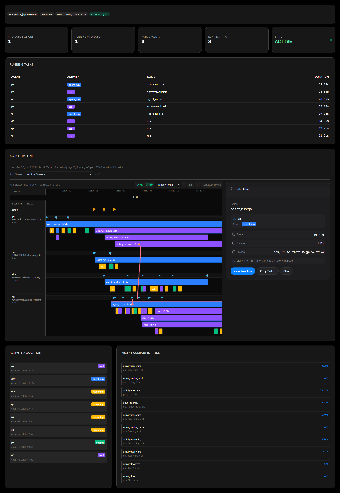
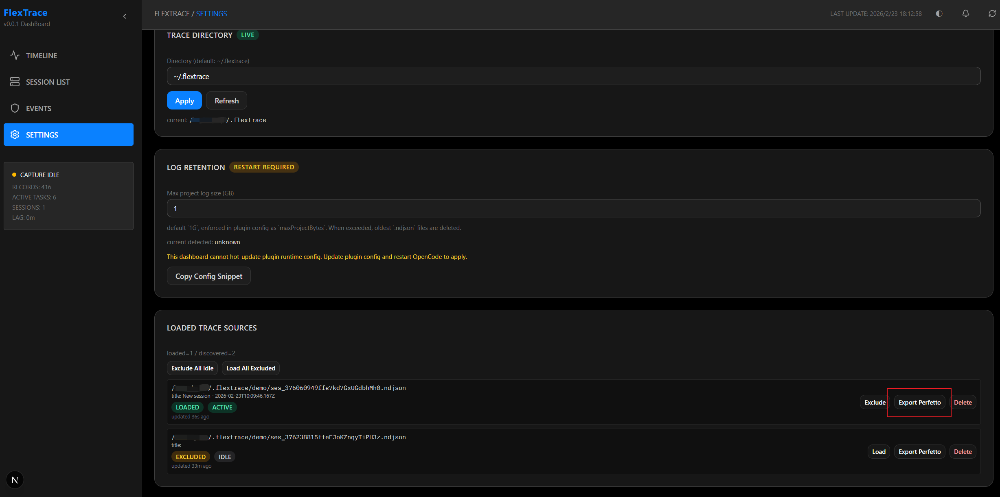
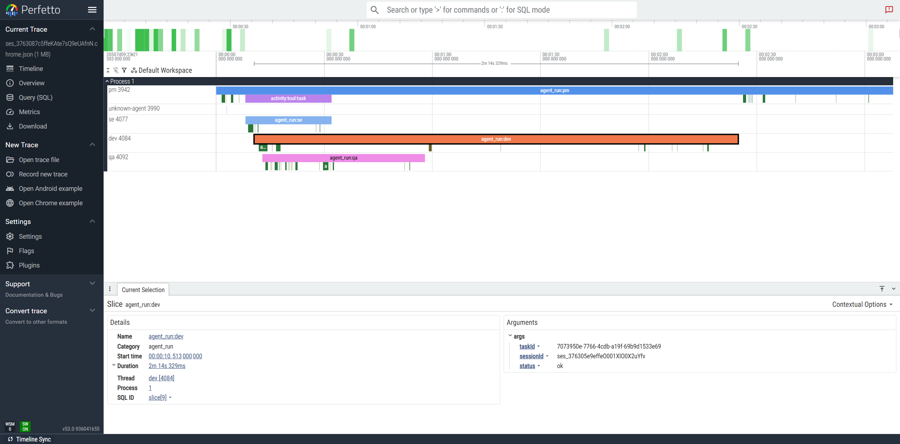

# FlexTrace

[English](README.md) | [中文](README-zh.md)

> 为 OpenCode 打造的 Agent 执行追踪与可观测插件  
> 参考 `perf` / `ftrace` 的思路，把 Agent 运行过程落成可分析的结构化轨迹。

------------------------------------------------------------------------

## ✨ 项目简介

**FlexTrace** 当前由两部分组成：

- `plugins/flextrace`：OpenCode 插件与 trace 采集核心
- `flextrace-dashboard`：本地实时看板（Next.js）

核心目标：

- 自动采集 OpenCode 会话与工具执行轨迹
- 提供 `trace_task / trace_event / trace_counter` 手动补点能力
- 用 root-session 维度组织 trace 文件
- 支持本地看板分析与 Perfetto 导出

------------------------------------------------------------------------
## ⚡ Quick Start

### Step 1 - 安装并启用插件

安装：

```bash
npm install flextrace-opencode@latest
```

在 `~/.config/opencode/opencode.json` 增加：

```json
{
  "plugin": [
    "flextrace-opencode@latest"
  ]
}
```

重启 OpenCode，用 `status` 确认插件已加载。

### Step 2 - 运行任意 Agent 任务

例如：

```text
帮我修复这个测试失败，并确保所有测试通过。
```

插件会自动产生 trace 到：

```text
~/.flextrace/<project_id>/
  _capture.ndjson
  <root_session_id>.ndjson
```

### Step 3 - 打开看板

```bash
cd flextrace-dashboard
npm install
npm run dev
```

浏览器打开本地地址（Next.js 默认端口）即可看到实时看板视图：

1、统计信息：支持查看实时运行的会话、agent、task等统计信息，并显示各任务当前的运行状态与时间。

2、TRACE TIMELINE：支持查看各agent、task的具体运行trace，并可以查看agent的调用关系



------------------------------------------------------------------------

### 🔎 导出到 Perfetto（可选）
支持命令行导出或kanban直接导出
```bash
tracectl export ~/.flextrace/<project_id>/<root_session_id>.ndjson \
  --out ./trace.chrome.json \
  --format chrome-trace
```



Perfetto 视图示例：
<https://ui.perfetto.dev>


------------------------------------------------------------------------

## 🎬 Demo

- 快速体验示例：`demo/README.md`
- 包含内容：skill 安装检查、`@pm` 触发多角色协作、看板链路查看

------------------------------------------------------------------------

## 🚀 核心能力

### 1️⃣ 多 Session / Root Session 追踪

- 按 `rootSessionId` 切分 `.ndjson` 文件
- 会话支持父子关系（`parentSessionId`）
- Dashboard 可一次加载多个 root-session 文件并筛选

### 2️⃣ 自动活动采集

插件会将 OpenCode 事件映射为可视化任务：

- `reasoning` 片段 -> `activity:reasoning`
- `tool` 片段 -> `activity:tool` 或 `activity:coding`（按工具白名单）
- assistant 轮次 -> `agent_run:*`

### 3️⃣ 手动插桩 API（工具级）

#### `trace_event`

```json
{ "tool": "trace_event", "args": { "name": "phase.spec_ready", "attrs": { "agent": "pm", "activity": "reasoning" } } }
```

#### `trace_task`

```json
{ "tool": "trace_task", "args": { "op": "start", "name": "phase:spec", "attrs": { "agent": "pm", "activity": "reasoning" } } }
{ "tool": "trace_task", "args": { "op": "end", "status": "ok" } }
```

#### `trace_counter`

```json
{ "tool": "trace_counter", "args": { "name": "artifact.count", "value": 3, "attrs": { "agent": "dev", "activity": "coding" } } }
```

### 4️⃣ 分析与导出

- `tracectl analyze`：输出摘要（任务数、错误数、P95、慢任务）
- `tracectl export`：导出 JSON / CSV / Chrome Trace
- `tracectl serve`：启动轻量本地 viewer

------------------------------------------------------------------------

## 🏗 Architecture Overview

```text
                 OpenCode Runtime
                        |
        +---------------+----------------+
        |                                |
   SSE / Event Stream              Tool Hooks
(session/message/part)       (tool.execute.before/after)
        |                                |
        +---------------+----------------+
                        v
                 flextrace-opencode
                        |
              +---------+---------+
              |                   |
       NDJSON Session Writer   Trace Tools
      (~/.flextrace/<project>) task/event/counter
              |
     +--------+-----------------------------+
     |                                      |
plugins/flextrace CLI                flextrace-dashboard
(analyze/export/serve)               (Timeline / Sessions / Events)
```

------------------------------------------------------------------------

## ⚙️ 配置

环境变量：

```bash
FLEXTRACE_ROOT=~/.flextrace
FLEXTRACE_MAX_PROJECT_BYTES=1073741824
```

以上为默认值，可通过环境变量修改，也可在 Kanban 的 Settings 中调整。

------------------------------------------------------------------------

## 📜 License

MIT License
